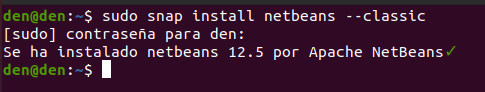
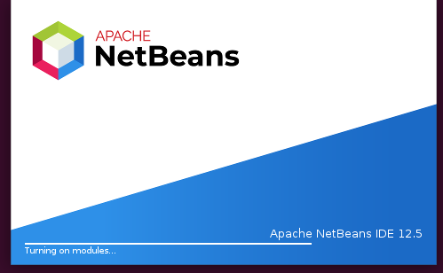

# Instalación de NetBeans 12.5 en Ubuntu 20.04
**Índice**

1. [Introducción](#1)
2. [Instalación de NetBeans](#2)
3. [Ejecutar NetBeans](#3)

## Introducción<a name="1"></a>
NetBeans es un entorno de desarrollo integrado libre que se utiliza para la creación de aplicaciones con lenguaje Java mayoritariamente, pero también se puede trabajar con otros lenguajes sin problema.

## Instalación NetBeans<a name="2"></a>
Abriremos nuestra terminal e ingresaremos la siguiente línea de comando:

```
sudo snap install netbeans --classic
```
De forma que nos pedirá la contraseña de administrador ya que lo estamos instalando con el comando `sudo`.

<div align="center">
 

 
</div>

Una vez finalizada la instalación nos aparecerá como se ve en la captura anterior un mensaje indicándonos que se ha instalado netbeans en su versión 12.5.

## Ejecutar NetBeans<a name="3"></a>
Podemos hacerlo de dos maneras:
  1. Directamente desde la terminal escribiendo netbeans.
  2. Ejecutando desde el icono que nos dejará en la caja de aplicaciones.

Una vez ejecutándose tardará la primera vez en abrirse al tener que cargar los módulos y todas las funciones que este contiene, se verá algo parecido así:

<div align="center">
 

 
</div>

Una vez ya abierto el programa nos aparecerá una ventana como esta:

<div align="center">
 

 
</div>

Por lo tanto ya podríamos empezar a utilizar nuestro IDE NetBeans.

