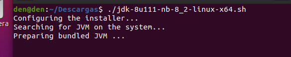

# Instalación de NetBeans 8.2 en Ubuntu 20.04
**Índice**

1. [Introducción](#1)
2. [Instalación de NetBeans](#2)
3. [Ejecutar NetBeans](#3)

## Introducción<a name="1"></a>
NetBeans es un entorno de desarrollo integrado libre que se utiliza para la creación de aplicaciones con lenguaje Java mayoritariamente, pero también se puede trabajar con otros lenguajes sin problema.

## Instalación NetBeans<a name="2"></a>
Descargamos directamente desde la página oracle con el siguiente enlace <a href="https://www.oracle.com/technetwork/java/javase/downloads/jdk-netbeans-jsp-3413139-esa.html">aquí</a>, le damos “Accept License Agreement” para que nos deje descargar, y según la arquitectura de nuestro sistema eligiremos, en mi caso Linux x64.
<div align="center">
 

 
</div>

Una vez descargado desde la terminal nos iremos al directorio donde se haya descargado con el comando ``cd``.

Luego le asignaremos permisos de ejecución con el siguiente comando:

```
chmod +x jdk-8u111-nb-8_2-linux-x64.sh
```

Aquí estamos indicando con el comando chmod que cambie los atributos del archivo que descargamos ejecutable ``(+x)``.

<div align="center">
 

 
</div>

Ejecutamos ahora el archivo con el siguiente comando:

./jdk-8u111-nb-8_2-linux-x64.sh

<div align="center">
 

 
</div>

Se abrirá un instalador y seguiremos los pasos.

<div align="center">
 

 
</div>

Le damos a “Next”.

<div align="center">
 

 
</div>

Indicamos la ruta de instalación para la JDK.

<div align="center">
 

 
</div>

Indicamos la ruta donde se instalará NetBeans.

<div align="center">
 

 
</div>

Nos mostrará un resumen de las rutas que indicamos las instalaciones, además marcaremos la casilla para que se realicen actualizaciones automáticas.

<div align="center">
 

 
</div>

La instalación iniciará y tomará unos segundos en completarse.

<div align="center">
 

 
</div>

Nos preguntará si queremos mandar información anónimamente en el proyecto de NetBeans, en mi caso desmarqué la casilla y terminará la instalación al darle a “finish”.

## Ejecutar NetBeans 8.2<a name="3"></a>

Antes de poder ejecutar NetBeans, una vez finalizada la instalación reiniciaremos nuestro equipo y dentro del cajón de aplicaciones buscaremos NetBeans y le daremos doble clic.

Se iniciará algo similar.

<div align="center">
 

 
</div>

Tardará un poco en cargar y cuando terminé podremos usar nuestro IDE.

<div align="center">
 

 
</div>

